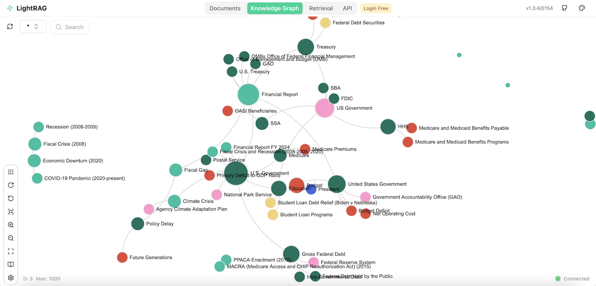
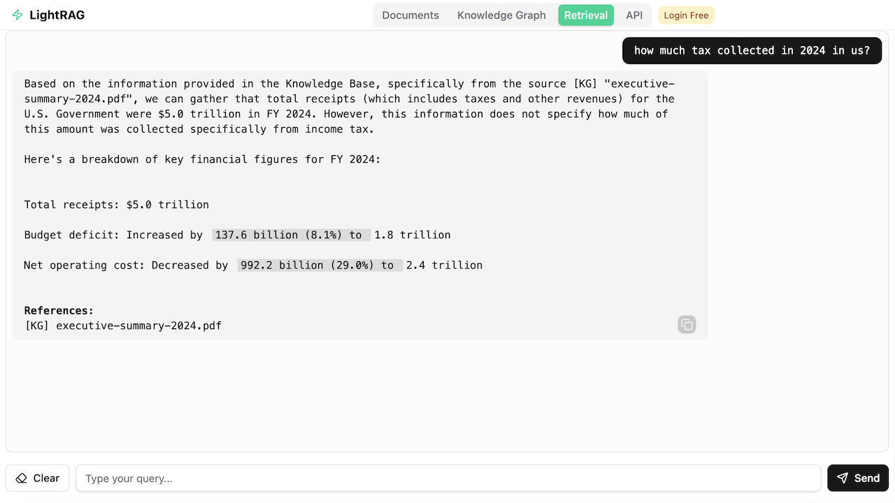

# 🚀 Run LightRAG on a Bare Metal Server in Minutes (Fully Automated)

This guide walks you through setting up a full RAG pipeline on your own bare metal server in just minutes. You'll launch:

- A bare metal server with Nvidia GPUs running **Sbnb Linux**
- A **VM with Ubuntu 24.04**
- The open-source [**LightRAG**](https://github.com/HKUDS/LightRAG) project
- PDF uploads to LightRAG to extract knowledge

---

## ✅ Why Run RAG on Your Own Bare Metal Server?

### 🔐 Privacy & Security
- Full control over your data - nothing leaves your server  
- Ideal for **sensitive or regulated data** (e.g., healthcare, finance, legal)  
- Compliant with **data sovereignty** requirements (e.g., store and process data within specific countries or jurisdictions)  
- No vendor lock-in - run everything locally or in your own cloud  

### 🔥 Performance
- Faster retrieval and inference

### 💸 Cost Efficiency
- No pay-per-call fees
- Predictable, one-time hardware investment

### 🛠️ Customization
- Your own retrievers, embeddings, chunking strategy
- Fine-tuned or quantized LLMs
- Flexible RAG pipelines (filters, rerankers, etc.)

### 🌐 Offline / Edge Ready
- Fully local operation
- Great for air-gapped or remote deployments

---

## Prerequisites

- Boot Bare Metal server into Sbnb Linux. Read more at [README-INSTALL.md](README-INSTALL.md).
- One or more Nvidia GPUs attached to the Bare Metal server
- Laptop with [Tailscale](https://tailscale.com/) configured to access the bare metal server for configuration.

---

## ⚙️ Step-by-Step Setup

### 1. Boot Bare Metal Server into Sbnb Linux

Follow [README-INSTALL.md](README-INSTALL.md) to boot your server into Sbnb Linux. After boot, verify it appears in your **Tailscale machine list**:


See [README-SERIAL-NUMBER.md](README-SERIAL-NUMBER.md) for automatic hostname assignment.

---

### 2. Connect Your Laptop to Tailscale

We use a MacBook in this tutorial, but any Linux/Unix laptop should work.

---

### 3. Download Tailscale Dynamic Inventory Script

```sh
curl https://raw.githubusercontent.com/m4wh6k/ansible-tailscale-inventory/refs/heads/main/ansible_tailscale_inventory.py -O
chmod +x ansible_tailscale_inventory.py
```

---

### 4. Pull Sbnb Linux Repo

```sh
git clone https://github.com/sbnb-io/sbnb.git
cd sbnb/automation/
```

---

### 5. Configure VM Settings

Edit `sbnb-example-vm.json`:

```json
{
    "vcpu": 16,
    "mem": "64G",
    "tskey": "your-tskey-auth",
    "attach_gpus": true,
    "image_size": "100G"
}
```

Replace `"your-tskey-auth"` with your actual **Tailscale auth key**.

---

### 6. Start VM with Ansible Playbook

```sh
export SBNB_HOSTS=sbnb-F6S0R8000719
ansible-playbook -i ./ansible_tailscale_inventory.py sbnb-start-vm.yaml
```

You should see the VM appear in Tailscale as `sbnb-vm-<VMID>` (e.g., `sbnb-vm-67f97659333f`).

> All Nvidia GPUs will be attached using vfio-pci.


---

### 7. Install Nvidia Drivers and Tools in the VM

```bash
export SBNB_HOSTS=sbnb-vm-67f97659333f

for playbook in install-docker.yaml install-nvidia.yaml install-nvidia-container-toolkit.yaml; do
  ansible-playbook -i ./ansible_tailscale_inventory.py $playbook
done
```

> Note that this time we set `SBNB_HOSTS` to the hostname of the VM we started in the previous step.

These commands will install Docker, Nvidia drivers, Nvidia container toolkit, and SGLang into the VM.

---

At this point, you have a VM running **Ubuntu 24.04** with **Nvidia GPU** attached.

---

## 🔁 Run LightRAG

```bash
ansible-playbook -i ./ansible_tailscale_inventory.py run-lightrag.yaml
```

This command will:

- Start the Ollama serving engine
- Download default LLM models for LightRAG ("bge-m3" and "mistral-nemo:latest")
- Launch LightRAG

✅ **LightRAG is up!**

---

## 🧠 Using LightRAG

### 1. Access the Web UI

Navigate to the VM hostname via Tailscale, using port `8000`. Example URL:

```
http://sbnb-0123456789-vm.tail730ca.ts.net:8000/
```

---

### 2. Upload Documents

For demo purposes, download the latest 2024 US government financial report (latest at the time of writing this tutorial):  

[executive-summary-2024.pdf](https://www.fiscal.treasury.gov/files/reports-statements/financial-report/2024/executive-summary-2024.pdf)

Then:

- Navigate to `Documents → Upload`
- Upload the PDF file

Wait until the **Status** reads **Completed**.


---

### 3. Verify data is parsed by checking Knowledge Graph

Navigate to the `Knowledge Graph` menu and confirm that it contains relevant data extracted from the uploaded PDF.



---

### 4. Start Chatting

Navigate to the `Retrieval` section and ask:

> "How much tax was collected in the US in 2024?"

✅ LightRAG responds with the answer **"... $5.0 trillion in FY 2024"** and cites the PDF.



---

🎉 **That's it!** You've successfully combined an LLM with your custom knowledge base.

Happy experimenting—and solving real-world problems!
