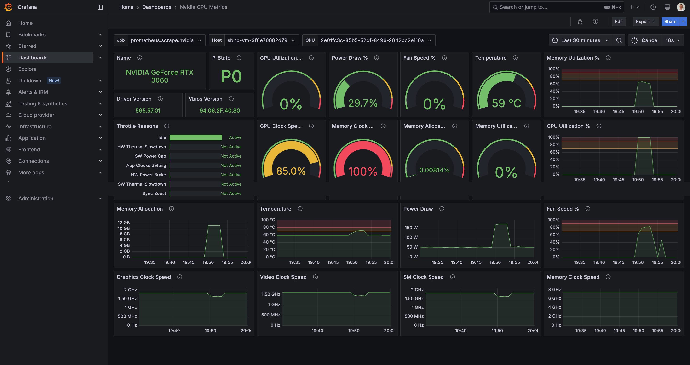

# Run Nvidia GPU Monitoring and Huggingface gpu-fryer under Sbnb Linux in Automated Way

This tutorial will show how to get a Bare Metal server up & running with Nvidia GPU monitoring using "nvidia-smi-exporter" and Grafana and run a stress test using Huggingface gpu-fryer in minutes with Sbnb Linux. At the end, you will be able to see the following monitoring graphs from your Bare Metal server. The graph below shows a GPU stress test for a few minutes, leading to a GPU load spike to 100%.



## Prerequisites
- Boot Bare Metal server into Sbnb Linux. Read more at [README-INSTALL.md](README-INSTALL.md).
- One or more Nvidia GPUs attached to the Bare Metal server
- Laptop with [Tailscale](https://tailscale.com/) configured to access the bare metal server for configuration.

## Howto

### 1. Boot Bare Metal Server into Sbnb Linux
Boot the Bare Metal server into Sbnb Linux using the instructions in [README-INSTALL.md](README-INSTALL.md). After booting, verify that the server appears in your **Tailscale machine list**.


For more details on automatic hostname assignments, refer to [README-SERIAL-NUMBER.md](README-SERIAL-NUMBER.md).

### 2. Connect Your Laptop to Tailscale
We will use a MacBook in this tutorial, but any machine, such as a Linux instance, should work the same.

### 3. Download Tailscale Dynamic Inventory Script
```sh
curl https://raw.githubusercontent.com/m4wh6k/ansible-tailscale-inventory/refs/heads/main/ansible_tailscale_inventory.py -O
chmod +x ansible_tailscale_inventory.py
```

### 4. Pull Sbnb Linux Repo with All Required Grafana Configs and Ansible Playbooks
```sh
git clone https://github.com/sbnb-io/sbnb.git
cd sbnb/automation/
```

### 5. Configure VM Settings
Open `sbnb-example-vm.json` file with an editor of your choice and configure the following parameters:
```json
{
    "vcpu": 2,
    "mem": "4G",
    "tskey": "your-tskey-auth",
    "attach_gpus": true,
    "image_size": "10G"
}
```
Replace `"your-tskey-auth"` with your actual Tailscale key.

### 6. Start VM with Ansible Playbook
```sh
export SBNB_HOSTS=sbnb-F6S0R8000719

ansible-playbook -i ./ansible_tailscale_inventory.py sbnb-start-vm.yaml
```

Once the VM starts, you should see it appear in the Tailscale network as `sbnb-vm-VMID`. For example, `sbnb-vm-67f97659333f`.

All Nvidia GPUs present in the system will be attached to this VM using a low-overhead vfio-pci mechanism:


### 7. Set Grafana Cloud Environment Variables

```sh
export GRAFANA_URL="https://prometheus-prod-13-prod-us-east-0.grafana.net/api/prom/push"
export GRAFANA_USERNAME="1962802"
export GRAFANA_PASSWORD="glc_<REDACTED>"
```

Replace `GRAFANA_URL`, `GRAFANA_USERNAME`, and `GRAFANA_PASSWORD` with your own credentials, which you can obtain from your Grafana Cloud account under:

```
Home -> Connections -> Data sources -> Your Prometheus Data Source -> Authentication
```

### 8. Start All Required Services in the VM
Run on the laptop:
```sh
export SBNB_HOSTS=sbnb-vm-67f97659333f

for playbook in install-docker.yaml install-nvidia.yaml install-nvidia-container-toolkit.yaml nvidia-smi-exporter.yaml grafana.yaml; do
  ansible-playbook -i ./ansible_tailscale_inventory.py $playbook
done
```

Note that this time we set `SBNB_HOSTS` to the hostname of the VM we started in the previous step.

The commands above will install Docker, Nvidia drivers, Nvidia container toolkit, nvidia-smi-exporter, and Grafana into the VM.

### 9. Run gpu-fryer
```sh
ansible-playbook -i ./ansible_tailscale_inventory.py run-gpu-fryer.yaml
```

### 10. Import Grafana Dashboard and Start Monitoring Your GPU!
Import [this Grafana dashboard](https://grafana.com/grafana/dashboards/14574-nvidia-gpu-metrics/) - It displays GPU load and metrics gathered from nvidia-smi, such as memory consumption, temperatures, fan speed, and power consumption in watts.

