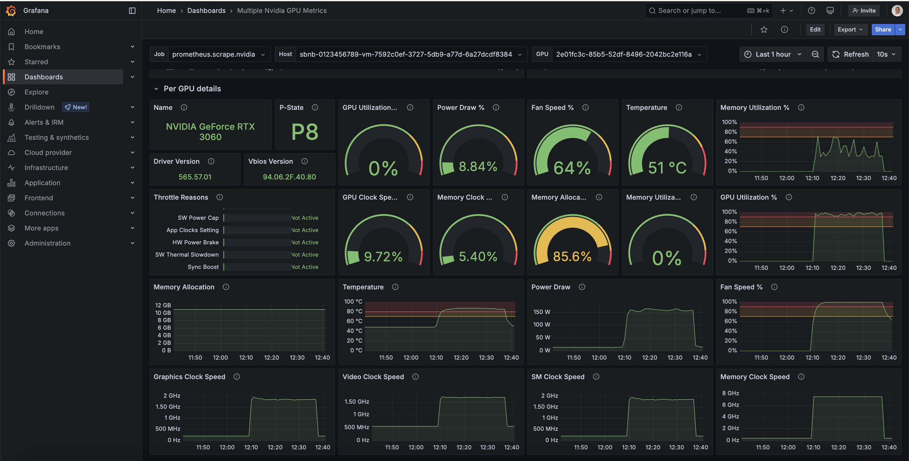

# Run vLLM with Nvidia GPU under Sbnb Linux in Automated Way

This tutorial will show how to get vLLM on a Bare Metal server up & running with Nvidia GPU in minutes.

We also start monitoring using Grafana and run a vLLM benchmark. At the end, you will be able to see the following vLLM benchmark results and monitoring graphs from your Bare Metal server.

The graph below shows GPU load during a vLLM benchmark test for a few minutes, leading to a GPU load spike to 100%. Memory allocation is at 90% per vLLM config.




## Prerequisites

- Boot Bare Metal server into Sbnb Linux. Read more at [README-INSTALL.md](README-INSTALL.md).
- One or more Nvidia GPUs attached to the Bare Metal server
- Laptop with [Tailscale](https://tailscale.com/) configured to access the bare metal server for configuration.


## Howto

### 1. Boot Bare Metal Server into Sbnb Linux
Boot the Bare Metal server into Sbnb Linux using the instructions in [README-INSTALL.md](README-INSTALL.md). After booting, verify that the server appears in your **Tailscale machine list**.


For more details on automatic hostname assignments, refer to [README-SERIAL-NUMBER.md](README-SERIAL-NUMBER.md).

### 2. Connect Your Laptop to Tailscale
We will use a MacBook in this tutorial, but any machine, such as a Linux instance, should work the same.

### 3. Download Tailscale Dynamic Inventory Script
```sh
curl https://raw.githubusercontent.com/m4wh6k/ansible-tailscale-inventory/refs/heads/main/ansible_tailscale_inventory.py -O
chmod +x ansible_tailscale_inventory.py
```

### 4. Pull Sbnb Linux Repo with All Required Grafana Configs and Ansible Playbooks
```sh
git clone https://github.com/sbnb-io/sbnb.git
cd sbnb/automation/
```

### 5. Configure VM Settings
Open `sbnb-example-vm.json` file with an editor of your choice and configure the following parameters:
```json
{
    "vcpu": 2,
    "mem": "4G",
    "tskey": "your-tskey-auth",
    "attach_gpus": true,
    "image_size": "10G"
}
```
Replace `"your-tskey-auth"` with your actual Tailscale key.

### 6. Start VM with Ansible Playbook
```sh
export SBNB_HOSTS=sbnb-F6S0R8000719

ansible-playbook -i ./ansible_tailscale_inventory.py sbnb-start-vm.yaml
```

Once the VM starts, you should see it appear in the Tailscale network as `sbnb-vm-VMID`. For example, `sbnb-vm-67f97659333f`.

All Nvidia GPUs present in the system will be attached to this VM using a low-overhead vfio-pci mechanism:


### 7. Configure vLLM

By default, `run-vllm.yaml` has the following settings:

```text
--max-model-len 2048
--gpu-memory-utilization 0.9
--tensor-parallel-size 2
--max-num-seqs 32
--enforce-eager
--model "allenai/OLMo-1B-hf"
```

We’re setting tensor parallelization `--tensor-parallel-size 2` because we have 2 Nvidia GPU cards in the system. We also choose a small model `"allenai/OLMo-1B-hf"` to fit our limited GPU memory (12GB * 2 = 24GB) in this setup.

Please refer to the vLLM engine arguments for more details:  
https://docs.vllm.ai/en/latest/serving/engine_args.html

### 8. Start vLLM in the VM

Run on the laptop:

```bash
export SBNB_HOSTS=sbnb-vm-67f97659333f

for playbook in install-docker.yaml install-nvidia.yaml install-nvidia-container-toolkit.yaml run-vllm.yaml; do
  ansible-playbook -i ./ansible_tailscale_inventory.py $playbook
done
```

> Note that this time we set `SBNB_HOSTS` to the hostname of the VM we started in the previous step.

These commands will install Docker, Nvidia drivers, Nvidia container toolkit, and vLLM into the VM.

**Congratulations!** Now you have vLLM up and running.

## Run vLLM Benchmark

Run on the laptop:

```bash
ansible-playbook -i ./ansible_tailscale_inventory.py run-vllm-benchmark.yaml
```

### Example Output of the Benchmark

```text
=========== Serving Benchmark Result ============
Successful requests:                     10000
Benchmark duration (s):                  1650.40
Total input tokens:                      10240000
Total generated tokens:                  1249339
Request throughput (req/s):              6.06
Output token throughput (tok/s):         756.99
Total Token throughput (tok/s):          6961.54
---------------Time to First Token----------------
Mean TTFT (ms):                          823866.75
Median TTFT (ms):                        822703.42
P99 TTFT (ms):                           1627880.13
-----Time per Output Token (excl. 1st token)------
Mean TPOT (ms):                          41.80
Median TPOT (ms):                        41.25
P99 TPOT (ms):                           64.80
---------------Inter-token Latency----------------
Mean ITL (ms):                           41.37
Median ITL (ms):                         18.53
P99 ITL (ms):                            179.15
==================================================
```

## Display GPU Utilization in Grafana

Follow this guide:  
[README-NVIDIA-GPU-FRYER-GRAFANA.md](README-NVIDIA-GPU-FRYER-GRAFANA.md)


## ✅ Summary

You now have:

- A GPU-enabled VM on Bare Metal running Sbnb Linux
- vLLM deployed automatically via Ansible
- Full monitoring via Grafana
- vLLM benchmark results confirming throughput and performance

**Happy experimenting with vLLM!**
